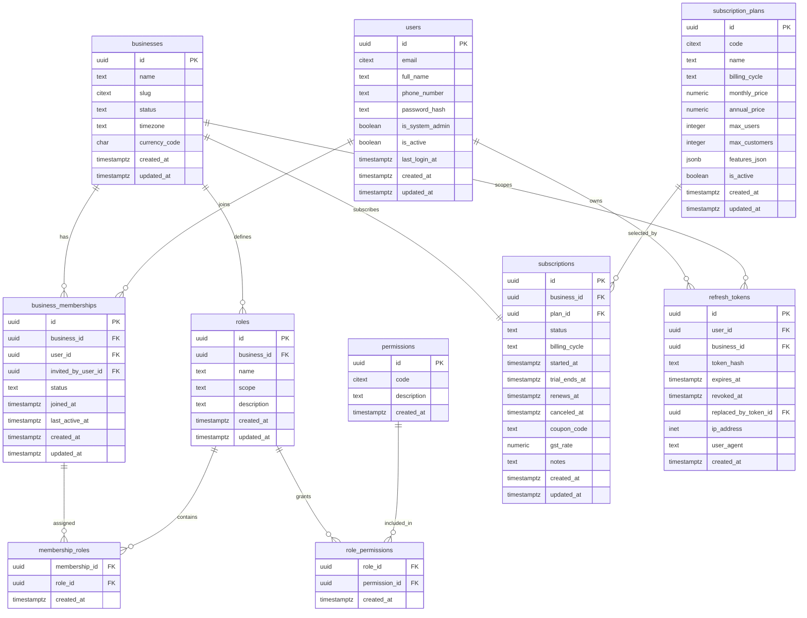
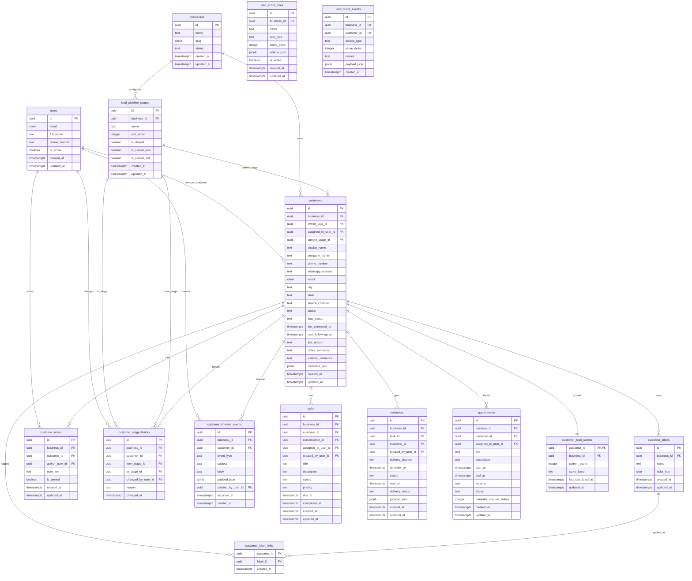
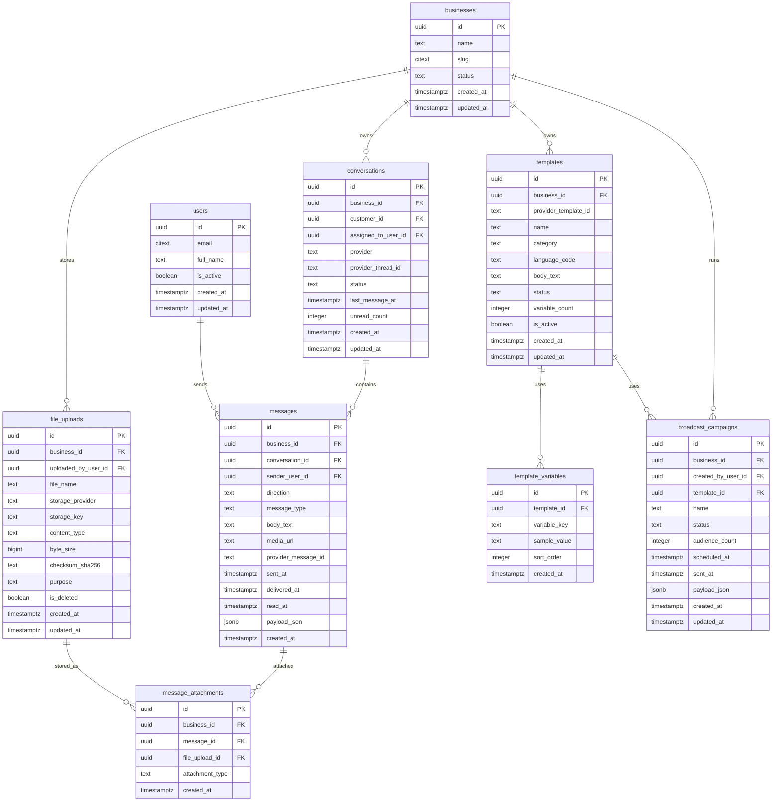
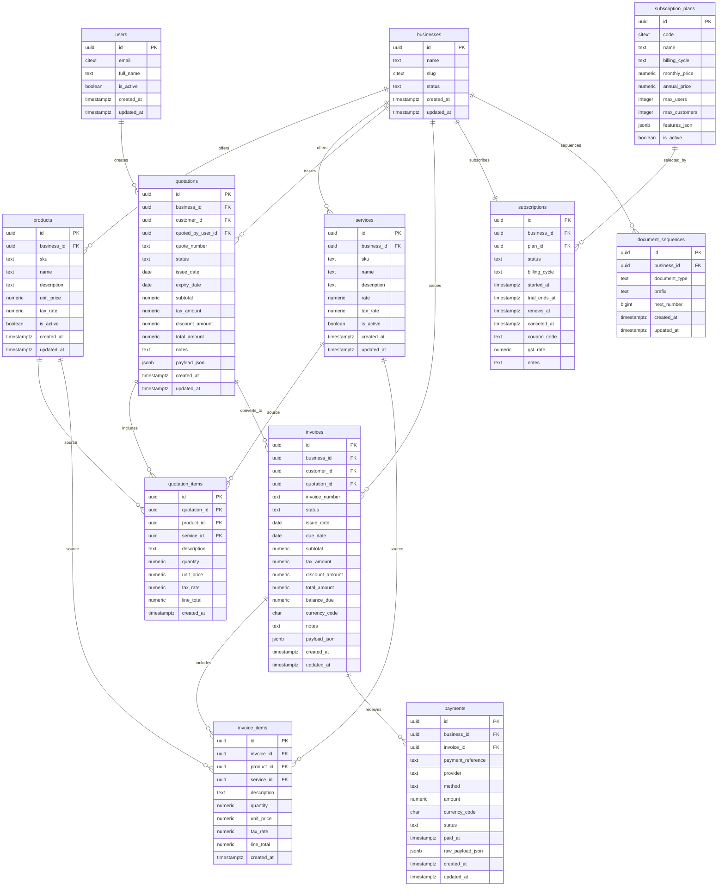
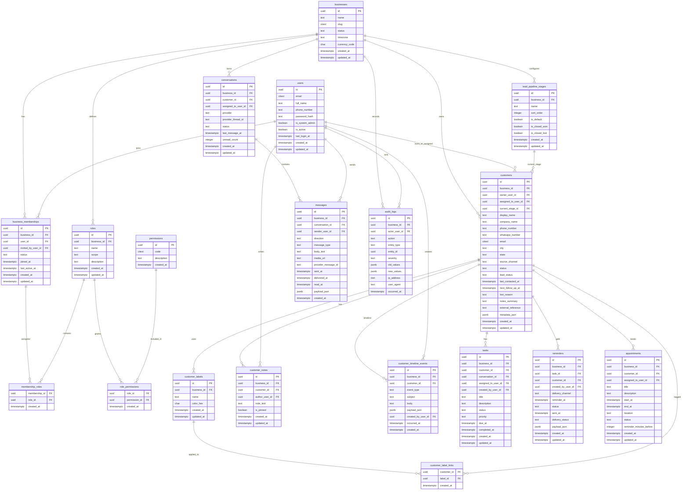

# WhatsFlow CRM Database ERD

This document contains two views of the PostgreSQL schema used by WhatsFlow CRM:

- Full ERD: the complete schema structure
- MVP-only ERD: the smaller operational core for the first delivery slice

## Full ERD

```mermaid
erDiagram
    businesses {
        uuid id PK
        text name
        citext slug
        text status
        timestamptz created_at
        timestamptz updated_at
    }

    users {
        uuid id PK
        citext email
        text full_name
        boolean is_active
        timestamptz created_at
        timestamptz updated_at
    }

    business_settings {
        uuid business_id FK
        citext setting_key
        text setting_value
        uuid updated_by_user_id FK
        timestamptz created_at
        timestamptz updated_at
    }

    settings_audit_trail {
        uuid id PK
        uuid business_id FK
        citext setting_key
        text old_value
        text new_value
        uuid changed_by_user_id FK
        timestamptz changed_at
    }

    integrations {
        uuid id PK
        uuid business_id FK
        text provider
        text name
        text status
        text external_account_id
        jsonb config_json
        bytea secrets_json_encrypted
        timestamptz last_synced_at
        timestamptz created_at
        timestamptz updated_at
    }

    support_tickets {
        uuid id PK
        uuid business_id FK
        uuid created_by_user_id FK
        uuid assigned_to_user_id FK
        text ticket_number
        text subject
        text description
        text status
        text priority
        text source
        timestamptz closed_at
        timestamptz created_at
        timestamptz updated_at
    }

    audit_logs {
        uuid id PK
        uuid business_id FK
        uuid actor_user_id FK
        text action
        text entity_type
        uuid entity_id
        text severity
        jsonb old_values
        jsonb new_values
        inet ip_address
        text user_agent
        timestamptz occurred_at
    }

    lead_score_rules {
        uuid id PK
        uuid business_id FK
        text name
        text rule_type
        integer score_delta
        jsonb criteria_json
        boolean is_active
        timestamptz created_at
        timestamptz updated_at
    }

    lead_score_events {
        uuid id PK
        uuid business_id FK
        uuid customer_id FK
        text source_type
        integer score_delta
        text reason
        jsonb payload_json
        timestamptz created_at
    }

    ai_assistant_sessions {
        uuid id PK
        uuid business_id FK
        uuid user_id FK
        uuid customer_id FK
        text title
        text status
        timestamptz created_at
        timestamptz updated_at
    }

    faq_entries {
        uuid id PK
        uuid business_id FK
        text question
        text answer
        text[] tags
        boolean is_active
        uuid created_by_user_id FK
        timestamptz created_at
        timestamptz updated_at
    }

    businesses ||--o{ business_settings : configures
    users ||--o{ business_settings : updates
    businesses ||--o{ settings_audit_trail : audits
    users ||--o{ settings_audit_trail : changes
    businesses ||--o{ integrations : owns
    businesses ||--o{ support_tickets : owns
    users ||--o{ support_tickets : creates
    users ||--o{ support_tickets : assigned
    businesses ||--o{ audit_logs : records
    users ||--o{ audit_logs : acts
    businesses ||--o{ lead_score_rules : defines
    businesses ||--o{ lead_score_events : tracks
    businesses ||--o{ ai_assistant_sessions : hosts
    users ||--o{ ai_assistant_sessions : opens
    businesses ||--o{ faq_entries : owns
    users ||--o{ faq_entries : creates
```

## MVP-only ERD

This version keeps only the first delivery slice: authentication, business onboarding, customer management, dashboard metrics, tasks, reminders, conversations, and audit logging.

## Notes

- The full ERD reflects the complete PostgreSQL schema in `db/postgres/whatsflow_schema.sql`.
- The MVP ERD is the smallest useful operational core for the current delivery slice.
- Both diagrams are Mermaid-compatible and can be rendered directly in Markdown viewers that support Mermaid.
